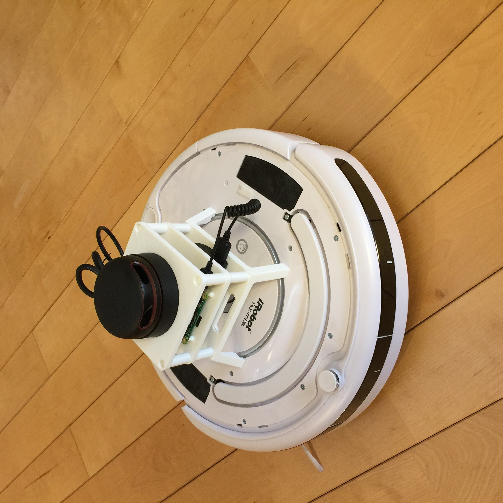

# Roomblock

Roomblock is a robot platform consists of a Roomba, a Raspberry Pi 2,
a RPLIDAR A2 and a mobile battery. It is good for the learning of the
ROS navigation system.

## Hardware

### Roomba

Roomba 500, 600 and 700 series are available.

### Raspberry Pi

Raspberry Pi 2 Model B is required.

Raspberry Pi 3 has not beconfirmed yet.

### Wifi dongle

- [Wifi dongle](https://www.amazon.co.jp/gp/product/B00ESA34GA)
- [Wifi dongle with antena](https://www.amazon.co.jp/gp/product/B00JWFCDGI)

### USB serial cable

This cable should be very handy.

http://akizukidenshi.com/catalog/g/gM-05841/

### Frame

3D printable data are available in [doc/stl](doc/stl) directory.

