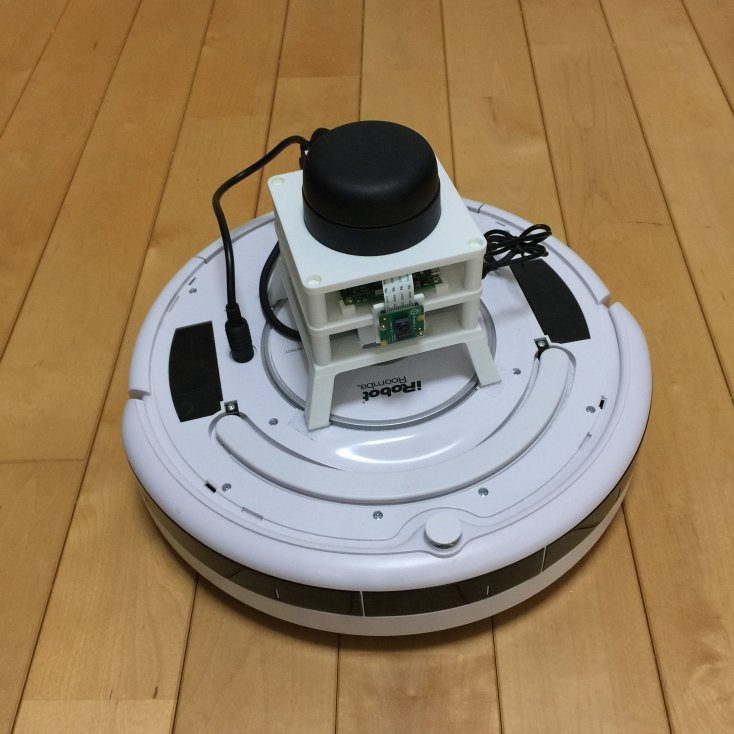
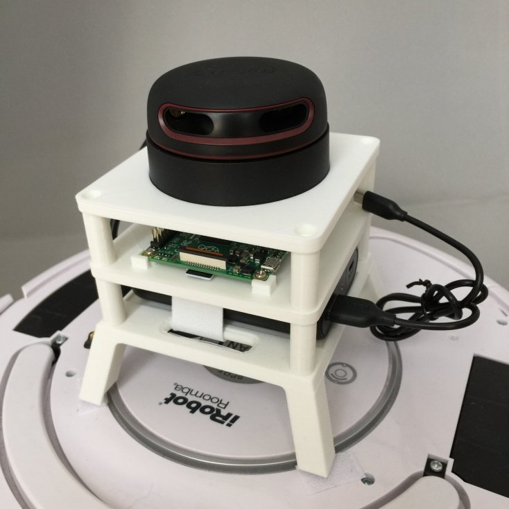

# Roomblock

Roomblock is a robot platform consists of a Roomba, a Raspberry Pi 2
or 3, a RPLIDAR A2 and a mobile battery. It is good for the learning
of the ROS navigation system.



## Hardware

### Roomba

We use Roomba 535 and 780. Roomba 500, 600, 700 and 800 series is
available to build the system. Caution, Roomba 900 series are not
available because they have no serial port.

### Raspberry Pi

You can use Raspberry Pi 2 Model B or Raspberry Pi 3. Pi3 has internal
WiFi module while Pi2 does not. The software installation is slightly
different, see Software section.

### WiFi dongle

You can use internal WiFi module with Pi3. You may need WiFi module
for Pi2. We use this WiFi dongle.

- [Planex GW-USNANO2A](https://www.amazon.co.jp/gp/product/B00ESA34GA)

This is small and no problem on Raspbian kernel. However, on new
Ubuntu kernel, it may cause a problem of frequent disconnection. To
avoid this, you need to install
[the fixed driver](https://github.com/pvaret/rtl8192cu-fixes). See:

- https://adamscheller.com/systems-administration/rtl8192cu-fix-wifi/
- http://l-w-i.net/t/ubuntu/wifi_001.txt

### USB serial cable

You need a USB-serial converter to make the Roomba and Raspberry Pi
communicate. We notice this product is very handy to make the
cable. Just cut the cable and solder to mini-DIN 9 pin connector.

- [FTDI USB-Serial converter cable(5V)](http://akizukidenshi.com/catalog/g/gM-05841/)

### Frame

3D printable data (STL) are available in
[Thingiverse](http://www.thingiverse.com/).

- [Roomblock: robot for learning navigation on ROS](http://www.thingiverse.com/thing:2209131)

## Software

### Ubuntu for Raspberry Pi 2

Download the Ubuntu image file for Raspberry Pi2 from
https://wiki.ubuntu.com/ARM/RaspberryPi#Raspberry_Pi and dump to a
micro SD card.

```
$ unxz ubuntu-16.04.3-preinstalled-server-armhf+raspi2.img.xz
$ dd bs=4M if=ubuntu-16.04.3-preinstalled-server-armhf+raspi2.img of=<dev file of your SD card>
```

Or you can use [Etcher](https://etcher.io/) insted of `dd`, which has
fancy GUI and easy to use.

### Ubuntu for Raspberry Pi 3

Same as Pi 2. Download the Ubuntu image file for Raspberry Pi 3 from
https://wiki.ubuntu.com/ARM/RaspberryPi#Raspberry_Pi and dump to a
micro SD card.

```
$ unxz ubuntu-16.04-preinstalled-server-armhf+raspi3.img.xz
$ dd bs=4M if=ubuntu-16.04-preinstalled-server-armhf+raspi3.img of=<dev file of your SD card>
```

The Ubuntu image for Pi3 is not official one, but it works anyway. 

You need to edit config.txt as mentioned in the section "Booting the official Pi 2 image on the Pi 3", or it doen't boot up after apt upgrade.


You may see internal WiFi (wlan0) is recognized by `ifconfig` as:

```
$ ifconfig -a
```

#### Important note

Repeat, you need to edit config.txt as mentioned in the section "Booting the official Pi 2 image on the Pi 3", or it doen't boot up after apt upgrade.

You should remove `cloud-init` package, because it may disable the network connection.

In addition, we strongly recommend to make the
firmware packages not being upgraded. If you upgrade the firmware, it
can disable the internal WiFi module.

You can do it as:

```
$ sudo apt-mark hold linux-firmware linux-firmware-raspi2

```

### ROS

Install ROS Kinetic following the install guide:

- [Ubuntu install of ROS Kinetic](http://wiki.ros.org/kinetic/Installation/Ubuntu)

Install script install_roomblock.sh may be helpful if you have same
hardwares to us.

#### Roomblock package released

The packages for roomblock are already released into Kinetic. So you don't need to build them by yourself. Use `apt` to
install.

```
$ sudo apt install ros-kinetic-roomblock
```

That's it.

#### Roomblock package released

If you want to customize the package code, you can build it by
yourself.  Clone roomblock source code and build them:

```
$ mkdir -p ~/catkin_ws/src
$ cd ~/catkin_ws/src
$ git clone https://github.com/tork-a/roomblock.git
$ cd ~/catkin_ws
$ rosdep install --from-paths src --ignore-src -r -y
$ catkin_make
```

### Raspberry Pi camera module

If you have a Rasberry Pi camera module, you need to install
libraspberrypi-dev. 

At first, you should add optional PPA as:

```
$ sudo add-apt-repository ppa:ubuntu-raspi2/ppa
$ sudo apt update
```

Somehow this package conflict with system package(libgles2-mesa-dev),
you need to overwrite the package explicitly.

```
$ apt download libraspberrypi-dev
$ sudo dpkg -i --force-overwrite libraspberrypi-dev.deb
$ sudo sh -c "echo 'start_x=1' >> /boot/firmware/config.txt"
$ sudo sh -c "echo 'gpu_mem=128' >> /boot/firmware/config.txt"
```

And you can use raspicam_node to use the camera on ROS:
```
$ git clone https://github.com/UbiquityRobotics/raspicam_node.git
$ cd ~/catkin_ws
$ rosdep install -r --from-path src --ignore-src
$ catkin_make
```

### Adjust clock both in Raspberry Pi and local PC

Raspberry Pi has no RTC(Real Time Clock), so the system clock is
always diverged from the correct time at each boot time. It causes
annoying problems. For example, move_base produce tf timeout error as:

```
[ WARN] [1456505621.806228153]: Costmap2DROS transform timeout. Current time: 1499505621.8061, global_pose stamp: 1499404347.1919, tolerance: 10.0000
```

You need to adjust the clock of Raspberry Pi and your local PC.
Do one-shot NTP(Network Time Protocol) adjustment as follows:

```
$ sudo apt install ntpdate
$ sudo ntpdate ntp.ubuntu.com
```

You can see the clock is adjusted by the message like:

```
20 Jul 11:37:19 ntpdate[9333]: adjust time server 91.189.91.157 offset 0.016635 sec
```

You can use 'ntpd' or 'chrony' to adjust the clock
automatically. Please search by yourself how to do so.
